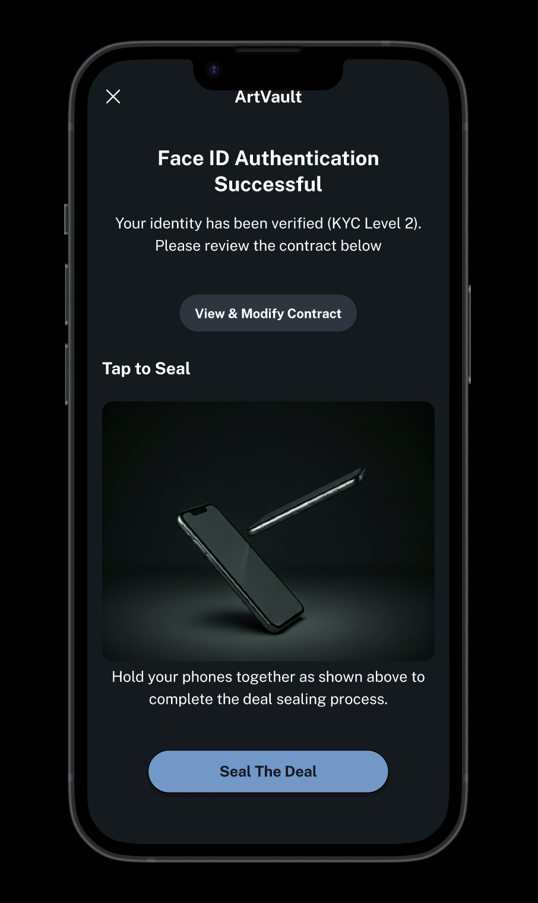

## ArtVault – Decentralized Escrow for Creative Projects

**ArtVault** is a modular smart contract system for milestone-based payments between clients and artists.  
It introduces **validator-based approval**, **automated releases via oracles**, and **dispute resolution**  
in a fully tested, gas-efficient Solidity design.

## Features

* **Escrow Mechanism** – Funds are securely held until validation
* **Milestone-based Payments** – Staged payment logic with strict controls
* **Validator System** – Only assigned validator can approve project
* **Refund System** – Refund only if no milestone released
* **Rule-Gated Releases** – Milestones can be gated by external logic (e.g. concert over, fraud flag, missing KYC) using a pluggable Forte Rules Engine module.
* **Forte Integration** – Rule engine and KYC compliance ready; fiat integration planned
* **Dispute Flagging** – Clients can flag disputes and track their status
* **Modular Contracts** – Separation of concerns: [Escrow / Validation / Oracle / Dispute](./contracts/ArtVault.sol)
* **Fraud Protection (Planned)** – Upcoming checks to detect suspicious behavior or double-spend attempts via override modules

## ForteRules Engine Integration (Live Smart Contract Support)

ArtVault now natively integrates the open-source [Forte Rules Engine](https://github.com/thrackle-io/forte-rules-engine), allowing real-time rule-based gating for milestone payments.

- Smart contract integration uses the `RulesEngineClient` interface  
- Onchain call to `validateRelease(user, rulesetId, data)` gates the release  
- `rulesetId` is set per project and is dynamic  
- Fallback, signature, and validator logic are preserved

**Key Solidity components:**
- `ArtVault.sol` – Checks `rulesetId > 0` and defers to `validateRelease(...)`
- `MockForteRules.sol` – Used in tests to simulate allowed/blocked rules

> This structure enables developers to plug any logic into milestone release: external delivery status, fraud scores, date-based rules, and more.

Example:
```solidity
if (rulesetIds[projectId] > 0 && address(rulesModule) != address(0)) {
    bytes memory data = abi.encode(projectId, milestoneId);
    bool allowed = IRulesModule(rulesModule).validateRelease(msg.sender, rulesetIds[projectId], data);
    require(allowed, "Release blocked by Forte rules");
}
```

## SealTheDeal – Instant, Secure, Artist-Friendly UX

At the heart of **ArtVault** is a bold promise:

> *Let artists and clients seal milestone-based contracts as easily as tapping their phones.*

To fulfill this vision, we designed **SealTheDeal** — a lightweight mobile interface that turns complex Web3 flows into a **frictionless, intuitive experience**.

Here's a preview of the mobile confirmation screen used just before sealing a deal:



---

### What this screen does:

* Confirms **Face ID** + **KYC Level 2** verification (artist identity is secured)
* Offers a quick **View & Modify Contract** option before finalizing
* Allows users to **tap their phones together** to trigger the deal
* Closes the loop with a one-click **Seal the Deal** button

---

### Why this matters:

Too many Web3 dApps feel like using a terminal.
**SealTheDeal** takes a different path: it feels like Apple Pay — *but for smart contracts.*

It's designed for:

* Artists on the go
* Real-world collaboration (concerts, commissions, live performances)
* Seamless finalization without losing trust or decentralization

This UI sits on top of the **ArtVault** smart contract suite, enabling:

* Milestone-based payments
* Oracle automation (for delivery, performance, etc.)
* Validator-controlled approval
* Optional dispute resolution

---

### What's next
We're currently building and testing this interface as part of our v1 milestone.
If you want to collaborate, contribute, or just follow along — reach out on LinkedIn.

## KYC / Identity Compliance (Forte Identity)
ArtVault reads on-chain KYC levels directly from Forte's public Compliance contract (Base Sepolia), using getAccessLevel(address) for transparent enforcement of access levels.

This enables:
- On-chain gating of deposits or withdrawals
- KYC-verified payout flows
- Grant compliance and public institution trust

## FortePay (Planned Integration)
FortePay is planned for integration. Fiat-based deposits would be routed to ArtVault through a backend relay or wallet bridge, while artists or freelancers receive ETH or stablecoins via ArtVault.
Funds can be escrowed until conditions are met (validator, time, or ForteRules).

This creates a Web2-friendly onramp into secure, milestone-based Web3 payments — ideal for DAOs, music agencies, grant platforms, and more.

## Combined Automation: Forte + Chainlink / Gelato
ArtVault's architecture is modular and supports both logic layers (Forte) and automation layers (Chainlink / Gelato).

| Layer           | Purpose                                                        |
|-----------------|----------------------------------------------------------------|
| ForteRules      | Business logic / compliance gating (canRelease)                |
| ForteIdentity   | On-chain access level (ACL) compliance check via Base Sepolia  |
| FortePay        | Fiat-to-crypto escrow routing                                  |
| Chainlink / Gelato | Time-based or data-driven release triggers (concert over, etc.) |

Docs: Forte KYC verification and access level contract are live on Base Sepolia.
RulesEngine logic is fully integrated onchain, with mock and test infrastructure included.

## Example Use Cases
- Live Performance – Release once the concert ends (timestamp or Forte validation)
- Physical Delivery – Delivery status → milestone release via oracle or rules
- Manual Validation – Validator confirms progress, unlocking release
- KYC-Gated Disbursement – Grants/institutions require access level before releasing
- Fallback Logic – Auto-release if no validation after X days
- Fraud Protection – Prevent double-release, spoofed identity, replay attacks

## Oracle Integration
ArtVault supports time-based and rule-based milestone releases via external oracles and logic engines (Chainlink, Gelato, Forte).
When the oracleModule is enabled via setProjectConfig, releaseMilestone may be triggered externally.

Tested in ArtVaultOracleMockTest:
- Early triggers are rejected
- Oracles can release milestones after expected conditions
- Manual release remains client-restricted

A full security section, tech stack, and roadmap follow this integration block.

## Workflow Diagram

```text
[ CLIENT ]
    |
    | 1. Create project + deposit funds
    ▼
[ ArtVault ]
    |
    | 2. Assign validator
    | 3. Wait for validation (manual or automated)
    ▼
[ VALIDATOR / ORACLE ]
    |
    | 4. Approve project (manually or via event/time oracle)
    ▼
[ ArtVault ]
    |
    | 5. Releases milestone payment
    ▼
[ ARTIST ]
```

[View interactive workflow diagram](docs/diagram.md)

## Smart Contract Architecture
- BaseContract.sol – Stores project state, shared modifiers, and events
- ValidationContract.sol – Handles validator assignment and validation flow
- EscrowContract.sol – Manages deposits, milestone release, and refunds
- DisputeModule.sol – Adds dispute registration with status enum
- ArtVault.sol – Main contract that composes all modules above
- ArtVaultOracleMock.sol – Mocked oracle for time-based triggers (e.g., concert ends)
- MockForteRules.sol – Test implementation of rules engine response

## Deployment & Testing
All contracts are modular and tested using Foundry.

To run the full suite and generate a gas report:

```bash
forge test --gas-report
```

See [`README-tests.md`](./README-tests.md) for:
- Detailed gas usage table
- Covered scenarios (happy path, reverts, refunds)
- Fuzz tests for boundary logic
- Oracle-triggered milestone automation
- Forte Rules integration tests (blocking/allowing via mock)
- Fallback delay-based tests

Oracle behavior is tested via injection (override pattern), with mock contracts in Foundry.

## Security Measures
- ETH Transfer Safety – Using call{value}() with success checks
- Payment Validation – Enforced divisibility to prevent leftover wei
- Emergency Pause – Global pause mechanism
- Access Control – onlyClient, onlyValidator, onlyOwner guards
- Custom Errors – Gas-efficient revert logic with typed messages
- Test Coverage – Over 50 tests with full logic coverage using forge test --via-ir

Important: While extensively tested, the protocol has not undergone a formal third-party audit yet. It is intended for research and testing only.

## Technology Stack
- Solidity ^0.8.19
- Foundry (Forge) – testing, fuzzing, CI
- OpenZeppelin Contracts – secure ERC & access controls
- Mock Oracles / Rules – for simulation of real-world behavior
- Modular Solidity Architecture – plug-and-play rules, signatures, fallback

## Roadmap
- Finalize fallback + signature module support
- Strengthen tests on ruleset branching
- Launch public demo of SealTheDeal interface
- Chainlink/Gelato oracle deployment for concerts
- Launch Arbitrum + Base test deployments
- Grant program applications for artist-centric use cases

## Contribution
This project is open-source and community-driven.
Submit bug reports, ideas, or pull requests — all are welcome.

## Contact & Links
Find me on LinkedIn
Or open an issue on GitHub to start the discussion.

## License
This project is licensed under the Business Source License 1.1 (BUSL-1.1).
You may view, fork, and contribute — commercial use prohibited until:

🕒 On **June 12, 2028**, this license will automatically convert to **Apache 2.0**.
