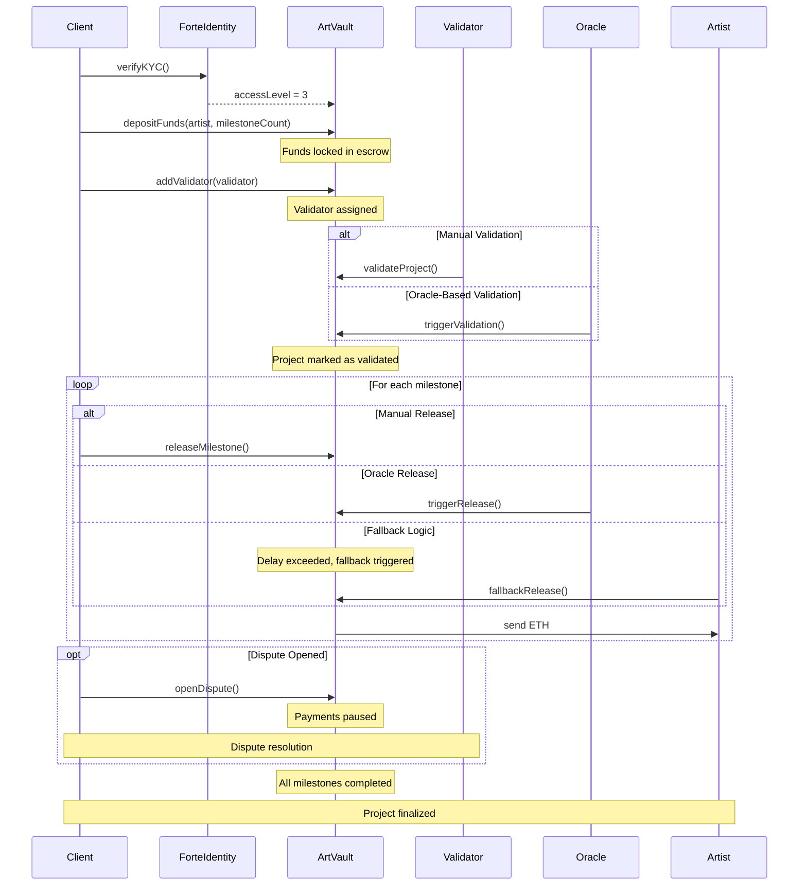

# 🔁 ArtVault Workflow Diagram

This diagram illustrates the complete workflow of the ArtVault protocol, showing interactions between all participants (Client, Artist, Validator, Oracle, Forte) and the different paths for milestone validation and release.

## Diagram Explanation

1. **KYC Verification**: Client is verified through ForteIdentity before initiating project.
2. **Initial Setup**: Client deposits ETH and defines milestones.
3. **Validator Assignment**: A trusted validator is added.
4. **Validation**: Happens either manually or through oracle logic (e.g., timestamp).
5. **Milestone Release**: Can be manual, oracle-triggered, or fallback-based.
6. **Dispute Handling**: Client may pause further payments if an issue arises.
7. **Completion**: Project ends when all milestones are released.

> Render this diagram using [Mermaid](https://mermaid.js.org/) or directly in compatible GitHub markdown preview.
