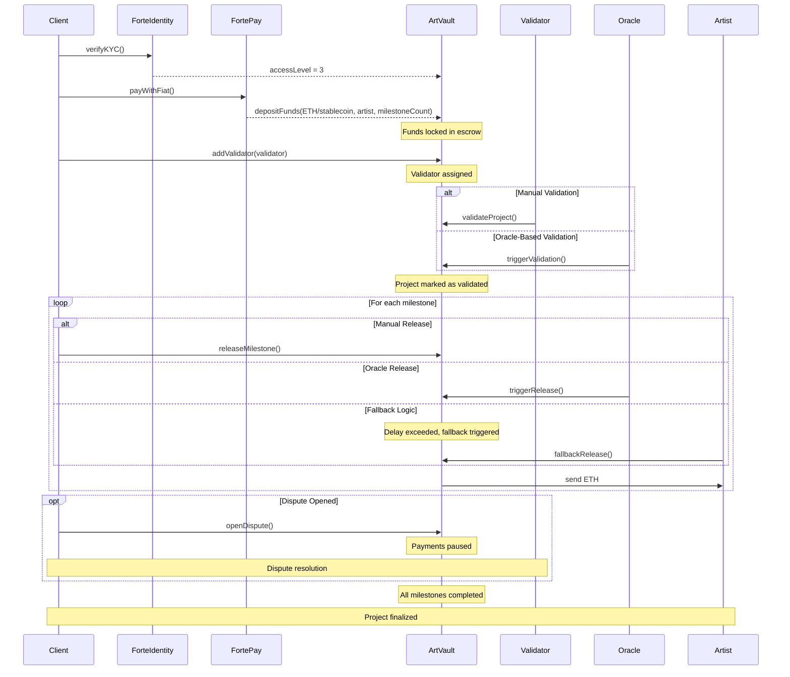

# 🔁 ArtVault Workflow Diagram

This diagram illustrates the complete workflow of the ArtVault protocol, showing interactions between all participants (Client, Artist, Validator, Oracle, Forte) and the different paths for milestone validation and release.

## Diagram Explanation

1. **KYC Verification**: Before creating a project, the client must pass a compliance check using ForteIdentity. Once verified, the user's access level is published on-chain and becomes readable by ArtVault.

2. **Fiat Payment Flow**: The client initiates a fiat payment using FortePay (e.g., card, ACH). FortePay converts the funds into ETH or stablecoin and deposits them into the ArtVault smart contract, locking them until release.

3. **Validator Assignment**: The client assigns a validator responsible for validating the project’s progress. This validator can later confirm whether the project is ready for milestone release.

4. **Validation**: A project can be validated manually by the assigned validator or automatically via an external oracle. The oracle might use event data (e.g., a concert ends) or rule logic (e.g., time passed).

5. **Milestone Release**: Funds are released in multiple stages. Each milestone can be triggered manually by the client, automatically by an oracle, or via fallback logic if no action occurs within a certain timeframe. Upon release, the specified portion of funds is transferred to the artist’s wallet.

6. **Dispute Handling**: At any point before the final milestone is released, the client may raise a dispute. This action pauses further payments and initiates a resolution process, involving the validator or future arbitration logic.

7. **Completion**: Once all milestones are paid and no disputes remain unresolved, the project is marked as completed. Both parties have fulfilled their roles.

> Render this diagram using [Mermaid](https://mermaid.js.org/) or directly in compatible GitHub markdown preview.

