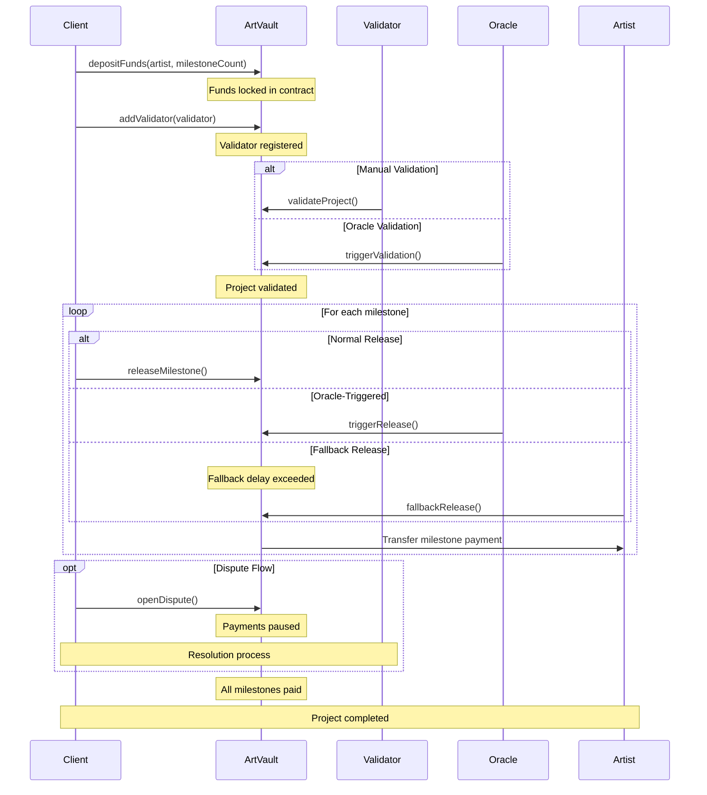

# ArtVault Workflow Diagram

This diagram illustrates the complete workflow of the ArtVault protocol, showing interactions between all participants (Client, Artist, Validator, Oracle) and the different paths for milestone validation and release.

## Diagram Explanation

1. **Initial Setup**: Client deposits funds and specifies milestone count
2. **Validator Assignment**: A validator is assigned to oversee the project
3. **Validation**: Can happen either manually by validator or automatically via oracle
4. **Milestone Release**: Three possible paths
   - Normal: Client triggers release
   - Oracle-Triggered: Automatic release based on conditions
   - Fallback: Artist can claim after delay
5. **Dispute Handling**: Optional flow that can be triggered by client
6. **Completion**: Project ends when all milestones are paid

This diagram can be rendered on GitHub or any Mermaid-compatible viewer. 